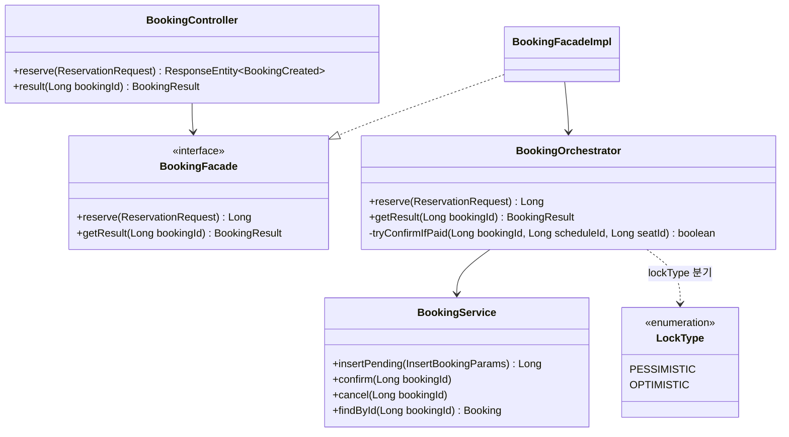
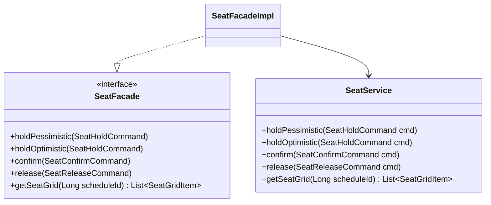
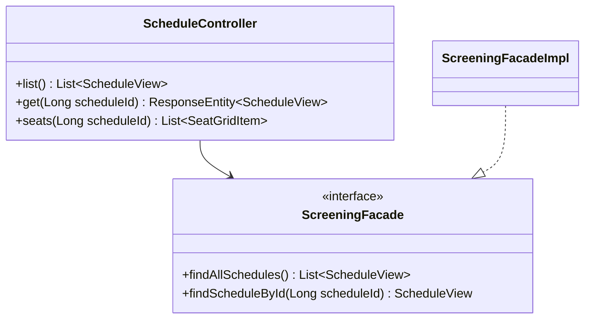
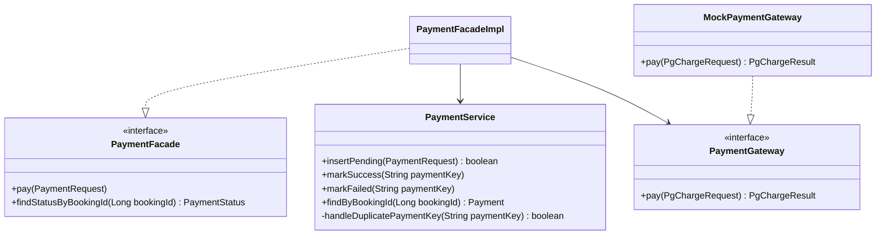
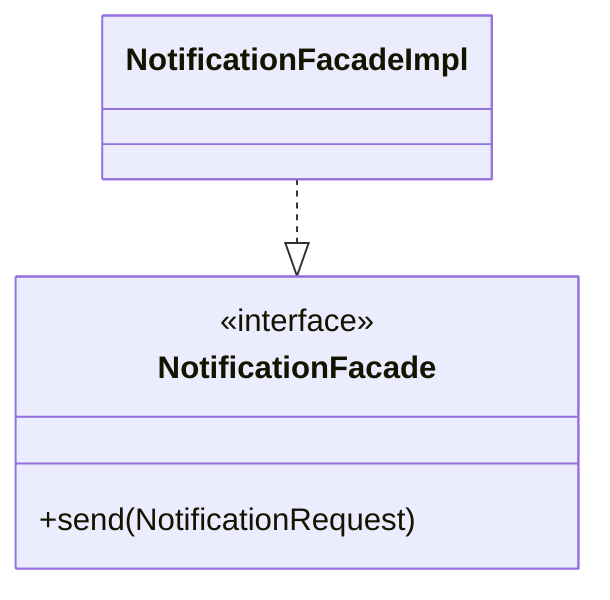
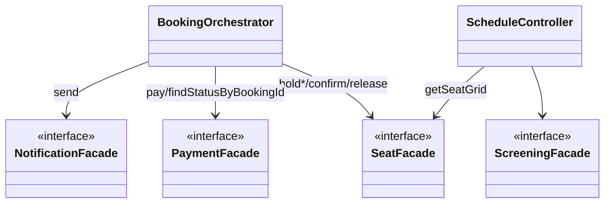
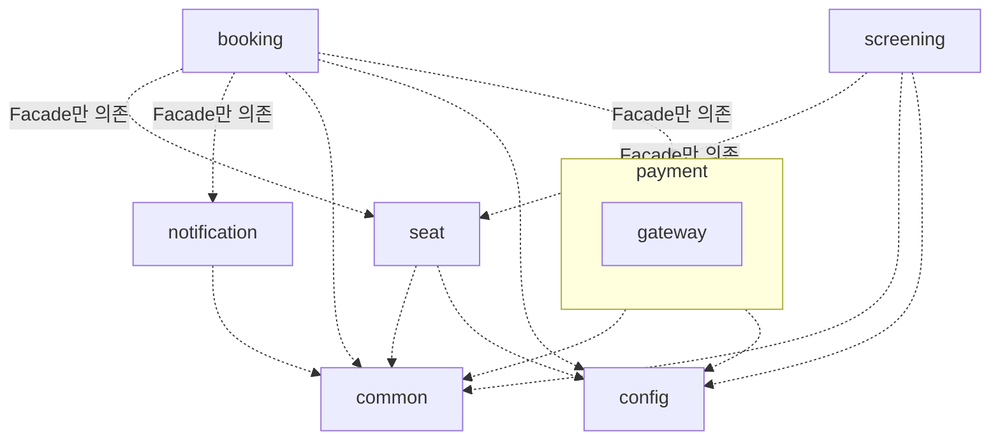

# Backend 다이어그램

> **최종 수정**: 2026-07-24
> 클래스 구조·패키지 의존 관계를 한눈에 파악하기 위한 시각화 문서.
> 각 클래스가 "왜" 그 자리에 있는지 같은 설계 이유는 [backend.md](backend.md) 참고 — 이 문서는 그림만 담는다.
> "무엇을 부르는가"(구조)는 여기, "언제/어떤 순서로 호출되는가"(흐름)는 [../flow.md](../flow.md)의 시퀀스 다이어그램 참고.

---

## 1. 클래스 다이어그램

> Facade(인터페이스+Impl) 경계와 각 클래스의 실제 메서드 시그니처까지 보여준다. `dto`/`mapper`/`domain`
> 세부 클래스는 [backend.md §2](backend.md#2-패키지-구조)의 패키지 트리 참고.
> **`XxxFacadeImpl`은 일부러 메서드를 안 적었다** — 전부 같은 이름의 메서드를 받아서 내부 Service에 그대로
> 위임만 하는 얇은(thin) 클래스라, 인터페이스(`XxxFacade`)에 적힌 시그니처와 100% 동일해서 중복 표기임.
> 하나로 합치면 가로로 너무 넓어져서(줌해도 안 보임) [flow.md](../flow.md)처럼 **도메인별로 쪼개서 세로로 쌓았다** —
> 도메인 간 연결은 맨 아래 "도메인 간 의존 관계(개요)" 하나로 따로 모음.

### booking 도메인

### seat 도메인

### screening 도메인

### payment 도메인

### notification 도메인

### 도메인 간 의존 관계 (개요)

> 위 5개 다이어그램에서 뺀 **cross-domain 화살표만** 모았다 — `BookingOrchestrator`/`ScheduleController`가
> 다른 도메인의 `Facade` 인터페이스만 아는 모습(AGENT.md §1 "경계는 Facade만")이 여기서 드러난다.

한눈에 보이는 것: (1) 모든 도메인이 `Facade`(인터페이스) + `Impl` 쌍으로 돼 있고 다른 도메인은 인터페이스만 의존 —
`BookingOrchestrator`가 `SeatFacadeImpl`이 아니라 `SeatFacade`만 아는 게 AGENT.md §1 "경계는 Facade만" 규칙이 코드로
드러난 모습. (2) `PaymentFacadeImpl`도 `PaymentGateway` 인터페이스만 의존하고 `MockPaymentGateway`는 그 구현체 중
하나일 뿐 — 나중에 실 PG로 교체해도 `PaymentFacadeImpl` 코드는 안 바뀜. (3) `-`로 표시된 `private` 메서드
(`BookingOrchestrator.tryConfirmIfPaid`, `PaymentService.handleDuplicatePaymentKey`)는 같은 클래스 안에서만
쓰는 내부 헬퍼라는 뜻 — 다른 클래스가 호출할 수 없다.

---

## 2. 패키지 다이어그램

> 클래스 다이어그램(§1)이 "클래스 하나하나가 뭘 하는가"라면, 이건 한 단계 위 — **패키지 자체를 하나의 박스로
> 취급**해서 어느 패키지가 어느 패키지를 아는지만 본다. 박스 안에 중첩된 박스(`payment` 안의 `gateway`)는
> "포함" 관계, 점선 화살표는 "의존"(import) 관계 — 표준 UML 패키지 다이어그램 표기법.

한눈에 보이는 것: (1) 화살표가 전부 도메인 패키지 → `Facade`가 있는 패키지 방향으로만 나간다 — 역방향(예:
`seat` → `booking`)이 하나도 없다는 게 AGENT.md §1 "도메인 간 소통은 Facade만" 규칙이 패키지 레벨에서도
지켜지고 있다는 뜻. (2) `payment.gateway`는 `payment` 안에 중첩된 박스로 그렸다 — 독립 도메인이 아니라
"record+프로세스가 같은 관심사"라 묶은 서브패키지이기 때문(backend.md §2). (3) `common`/`config`로 가는
화살표는 전부 방향이 한쪽(도메인 → common/config)이다 — `common`/`config`는 어떤 도메인도 모른다(순환 의존 없음).
