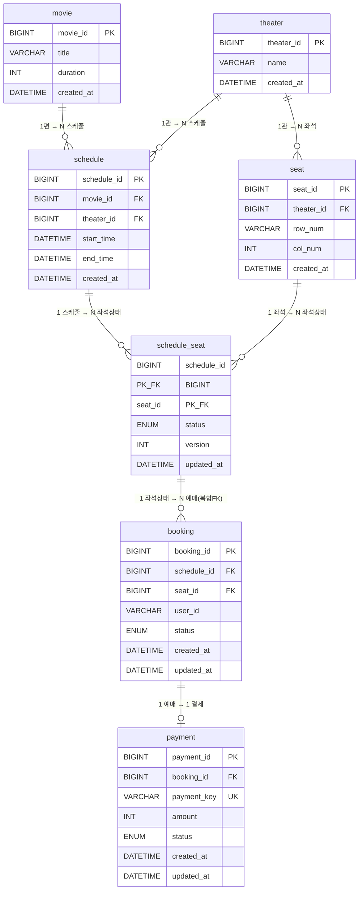

# DB 다이어그램

> **최종 수정**: 2026-07-17
> 테이블 간 연관관계를 한눈에 파악하기 위한 시각화 문서.
> 상세 컬럼 설명·설계 근거는 [db.md](./db.md) 참고.

---

## 1. ERD (Entity-Relationship Diagram)



---

## 2. 관계 흐름 요약

```
[고정 마스터 데이터]               [Saga가 관리하는 데이터]

  movie ──────┐
              │ 1:N
  theater ────┼──────── schedule
     │        │              │ 1:N
     │ 1:N    │              ▼
     └─── seat ─────── schedule_seat  ← ⭐ 동시성 제어 타깃
              복합FK        │              status: AVAILABLE / HELD / BOOKED
                            │ 1:N (복합FK)
                            ▼
                         booking        ← Saga 생성·업데이트
                            │              status: PENDING / CONFIRMED / CANCELLED
                            │ 1:1
                            ▼
                         payment        ← Mock 게이트웨이 대상
                            payment_key UNIQUE (멱등성)
                            status: PENDING / SUCCESS / FAILED
```

---

## 3. 핵심 포인트 한눈에 보기

### schedule_seat — 이 프로젝트의 중심

```
┌─────────────────────────────────────────────┐
│              schedule_seat                  │
│                                             │
│  PK  schedule_id ──FK──▶ schedule           │
│  PK  seat_id     ──FK──▶ seat               │
│                                             │
│  status  AVAILABLE ──hold()──▶ HELD         │
│                      HELD ──confirm()──▶ BOOKED  │
│                      HELD ──release()──▶ AVAILABLE │
└─────────────────────────────────────────────┘
         ▲
         │ 복합 FK (schedule_id + seat_id)
         │
    booking (schedule_id, seat_id, status...)
```

- `schedule_id`와 `seat_id` 두 컬럼이 **동시에 PK이자 FK**
- 이 행 하나가 `SELECT ... FOR UPDATE` 락의 최소 단위
- `booking`이 이 복합키를 FK로 참조 → 없는 조합의 예매를 DB가 차단

---

### ENUM 상태 흐름

```
[schedule_seat.status]           [booking.status]          [payment.status]

AVAILABLE                        (아직 없음)                (아직 없음)
    │
    │ hold()
    ▼
  HELD          ────────────▶  PENDING      ──────────▶   PENDING
    │                                                          │
    │                                             ┌───────────┴───────────┐
    │                                           SUCCESS               FAILED
    │                                             │                       │
    │ confirm()                                   │           release()   │
    ▼                                             ▼               ▼       │
 BOOKED         ────────────▶  CONFIRMED    AVAILABLE   CANCELLED ◀───────┘
```

---

## 4. 테이블별 키 제약 요약

| 테이블 | PK | FK | UNIQUE |
|--------|----|----|--------|
| `movie` | `movie_id` | — | — |
| `theater` | `theater_id` | — | — |
| `seat` | `seat_id` | `theater_id` | `(theater_id, row_num, col_num)` |
| `schedule` | `schedule_id` | `movie_id`, `theater_id` | — |
| `schedule_seat` | `(schedule_id, seat_id)` 복합 | `schedule_id`, `seat_id` 각각 | — (`version`은 충돌감지형/낙관적 락 카운터) |
| `booking` | `booking_id` | `(schedule_id, seat_id)` 복합 | — |
| `payment` | `payment_id` | `booking_id` | `payment_key` |
