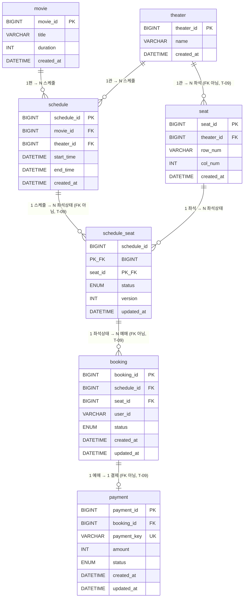

# DB 다이어그램

> **최종 수정**: 2026-07-21
> 테이블 간 연관관계를 한눈에 파악하기 위한 시각화 문서.
> 상세 컬럼 설명·설계 근거는 [db.md](./db.md) 참고.
> **T-09(2026-07-21) 이후**: 도메인별로 스키마(DB)가 나뉘었다 — `screening_db`(movie/theater/schedule),
> `seat_db`(seat/schedule_seat), `booking_db`(booking), `payment_db`(payment). 아래 다이어그램의
> "FK 아님" 표시가 붙은 관계는 예전엔 진짜 FK였으나 스키마 경계를 건너가서 제거된 것 — 값으로만
> 참조하고, 정합성은 애플리케이션(Saga 호출 순서)이 책임진다.

---

## 1. ERD (Entity-Relationship Diagram)



> `theater ||--o{ seat`, `schedule ||--o{ schedule_seat`, `schedule_seat ||--o{ booking`,
> `booking ||--o| payment` 네 관계는 스키마가 갈리면서 DB FK가 아니게 됐다(T-09). 논리적 관계는
> 여전히 유효하지만(값으로 참조), MySQL이 보장해주지 않는다. `seat ||--o{ schedule_seat`(같은
> `seat_db` 내부), `movie`/`theater` → `schedule`(같은 `screening_db` 내부)은 FK 그대로 유지.

---

## 2. 관계 흐름 요약

```
[screening_db]                      [seat_db]              [booking_db]     [payment_db]

  movie ──────┐
              │ 1:N
  theater ────┼──────── schedule
     │        │              ┆ 1:N (FK 아님, T-09)
     │ 1:N    │              ▼
     └┄┄┄ seat ┄┄┄┄┄┄┄ schedule_seat  ← ⭐ 동시성 제어 타깃
         (FK 아님, T-09) │              status: AVAILABLE / HELD / BOOKED
                            │ 1:N (FK 아님, T-09)
                            ▼
                         booking        ← Saga 생성·업데이트
                            │              status: PENDING / CONFIRMED / CANCELLED
                            ┆ 1:1 (FK 아님, T-09)
                            ▼
                         payment        ← Mock 게이트웨이 대상
                            payment_key UNIQUE (멱등성)
                            status: PENDING / SUCCESS / FAILED
```

---

## 3. 핵심 포인트 한눈에 보기

### schedule_seat — 이 프로젝트의 중심

```
┌─────────────────────────────────────────────┐
│              schedule_seat                  │
│                                             │
│  PK  schedule_id  (screening_db 참조, FK 아님, T-09)│
│  PK  seat_id     ──FK──▶ seat (같은 seat_db) │
│                                             │
│  status  AVAILABLE ──hold()──▶ HELD         │
│                      HELD ──confirm()──▶ BOOKED  │
│                      HELD ──release()──▶ AVAILABLE │
└─────────────────────────────────────────────┘
         ┆
         ┆ (schedule_id + seat_id, FK 아님 — T-09, booking_db로 스키마 분리)
         ┆
    booking (schedule_id, seat_id, status...)
```

- `schedule_id`와 `seat_id` 두 컬럼이 **동시에 PK**. `seat_id`만 FK(같은 스키마 `seat_db`), `schedule_id`는
  `screening_db.schedule`을 값으로만 참조 (T-09)
- 이 행 하나가 `SELECT ... FOR UPDATE` 락의 최소 단위
- `booking`은 더 이상 이 복합키를 FK로 참조하지 않는다(T-09) — 존재하지 않는 조합의 예매를 막는 역할은
  Saga의 `hold()` 성공 여부(애플리케이션 레벨)로 이전됨

---

### ENUM 상태 흐름

```
[schedule_seat.status]           [booking.status]          [payment.status]

AVAILABLE                        (아직 없음)                (아직 없음)
    │
    │ hold()
    ▼
  HELD          ────────────▶  PENDING      ──────────▶   PENDING
    │                                                          │
    │                                             ┌───────────┴───────────┐
    │                                           SUCCESS               FAILED
    │                                             │                       │
    │ confirm()                                   │           release()   │
    ▼                                             ▼               ▼       │
 BOOKED         ────────────▶  CONFIRMED    AVAILABLE   CANCELLED ◀───────┘
```

---

## 4. 테이블별 키 제약 요약

| 테이블 | 스키마 | PK | FK | UNIQUE |
|--------|--------|----|----|--------|
| `movie` | `screening_db` | `movie_id` | — | — |
| `theater` | `screening_db` | `theater_id` | — | — |
| `seat` | `seat_db` | `seat_id` | 없음 (`theater_id`는 값 참조, FK 아님 — T-09) | `(theater_id, row_num, col_num)` |
| `schedule` | `screening_db` | `schedule_id` | `movie_id`, `theater_id` | — |
| `schedule_seat` | `seat_db` | `(schedule_id, seat_id)` 복합 | `seat_id`만 (`schedule_id`는 값 참조, FK 아님 — T-09) | — (`version`은 충돌감지형/낙관적 락 카운터) |
| `booking` | `booking_db` | `booking_id` | 없음 (`(schedule_id, seat_id)`는 값 참조, FK 아님 — T-09) | — |
| `payment` | `payment_db` | `payment_id` | 없음 (`booking_id`는 값 참조, FK 아님 — T-09) | `payment_key` |
