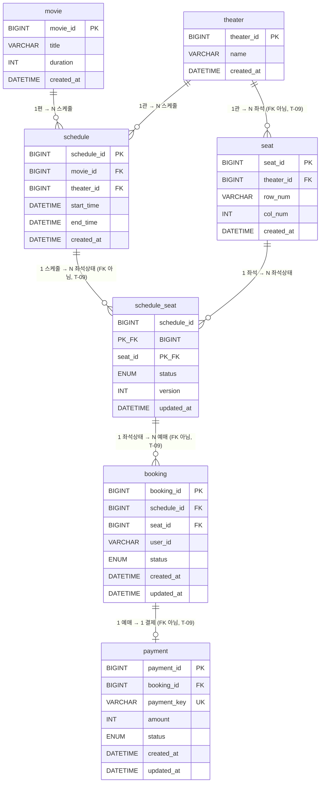

# DB 다이어그램

> **최종 수정**: 2026-07-21
> 테이블 간 연관관계를 한눈에 파악하기 위한 시각화 문서.
> 상세 컬럼 설명·설계 근거는 [db.md](./db.md) 참고.
> **T-09(2026-07-21) 이후**: 도메인별로 스키마(DB)가 나뉘었다 — `screening_db`(movie/theater/schedule),
> `seat_db`(seat/schedule_seat), `booking_db`(booking), `payment_db`(payment). 아래 다이어그램의
> "FK 아님" 표시가 붙은 관계는 예전엔 진짜 FK였으나 스키마 경계를 건너가서 제거된 것 — 값으로만
> 참조하고, 정합성은 애플리케이션(Saga 호출 순서)이 책임진다.

---

## 1. ERD (Entity-Relationship Diagram)



> `theater ||--o{ seat`, `schedule ||--o{ schedule_seat`, `schedule_seat ||--o{ booking`,
> `booking ||--o| payment` 네 관계는 스키마가 갈리면서 DB FK가 아니게 됐다(T-09). 논리적 관계는
> 여전히 유효하지만(값으로 참조), MySQL이 보장해주지 않는다. `seat ||--o{ schedule_seat`(같은
> `seat_db` 내부), `movie`/`theater` → `schedule`(같은 `screening_db` 내부)은 FK 그대로 유지.

> 스키마별 테이블 배치(어느 테이블이 어느 DB에 있는지)는 표로 정리된 [db.md §1](db.md#1-스키마-배치)
> 참고 — 위 ERD와 겹치지 않게 이 문서는 관계·상태 흐름 그림만 담는다.
> PK/FK/UNIQUE 제약 상세, `schedule_seat`가 왜 이런 구조인지 같은 설계 이유는 [db.md](db.md) 참고.

---

## 2. ENUM 상태 흐름

```
[schedule_seat.status]           [booking.status]          [payment.status]

AVAILABLE                        (아직 없음)                (아직 없음)
    │
    │ hold()
    ▼
  HELD          ────────────▶  PENDING      ──────────▶   PENDING
    │                                                          │
    │                                             ┌───────────┴───────────┐
    │                                           SUCCESS               FAILED
    │                                             │                       │
    │ confirm()                                   │           release()   │
    ▼                                             ▼               ▼       │
 BOOKED         ────────────▶  CONFIRMED    AVAILABLE   CANCELLED ◀───────┘
```

