# 코드 흐름도

> **최종 수정**: 2026-07-24 (T-04 `BookingTimeoutBatch` 추가)
> **목적**: 실제로 만든 파일들이 서로를 어떻게 호출하는지 시퀀스 다이어그램으로 추적한다.
> 설계 이유(왜 이렇게 만들었는가)는 [backend/backend.md](backend/backend.md) 참고 — 이 문서는 "무엇이 무엇을 부르는가"에만 집중한다.
> **구조(정적) vs 흐름(동적)**: 인터페이스/구현체 경계나 도메인 간 의존 "구조", 클래스/패키지 다이어그램만 보고 싶으면
> [backend/diagram.md](backend/diagram.md) 참고 — 이 문서(§1 이하)는 HTTP 라우팅·DB 타깃까지 포함한 실제 호출
> 경로와 시간 순서(시퀀스)에 집중한다.
> **갱신 규칙**: 도메인 하나가 완성될 때마다 사용자가 말하지 않아도 자동으로 이 문서를 갱신한다 (AGENT.md §7).
> 모든 Controller는 `@RestController`다 — 뷰를 만들지 않고 JSON만 응답한다. 화면(정적 HTML/JS)이 fetch로 호출한다.

---

## 1. 전체 그림 (도메인 간 호출) ✅ 전체 완성 — 백엔드 + 프론트 end-to-end 연결됨

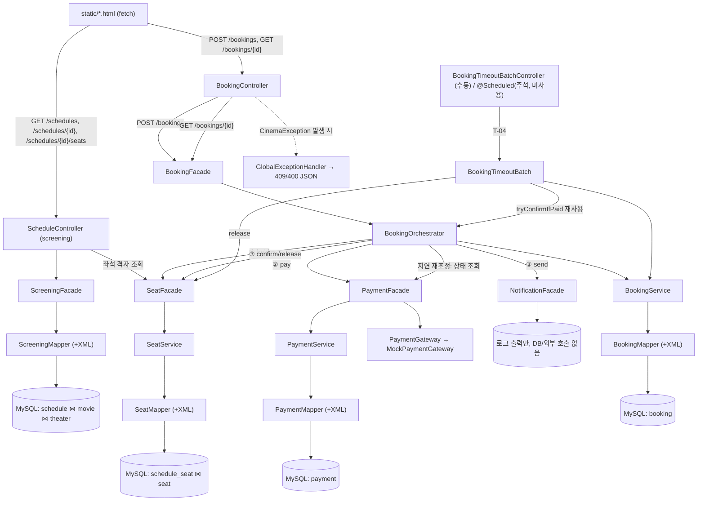

백엔드·프론트·에러 처리까지 전부 연결되어 브라우저로 목록→좌석선택→예매→결과 전체 플로우 실제 검증 완료 (2026-07-18).
남은 건 `T-04`(HELD 타임아웃)뿐 — `T-06`(낙관적 락 충돌 재시도)은 재시도 없이 그대로 예외를 던지는 것으로 결정 완료.

---

## 2. `screening` (스케줄 탐색) ✅ 완성

Saga에 참여하지 않는 순수 조회. `ScheduleController`도 다른 도메인과 동일하게 `ScreeningFacade`를 거쳐서만
`ScreeningMapper`에 닿는다 — 상태 전이 로직이 없어 Service 계층만 생략했다 (docs/backend/backend.md §2 참고).

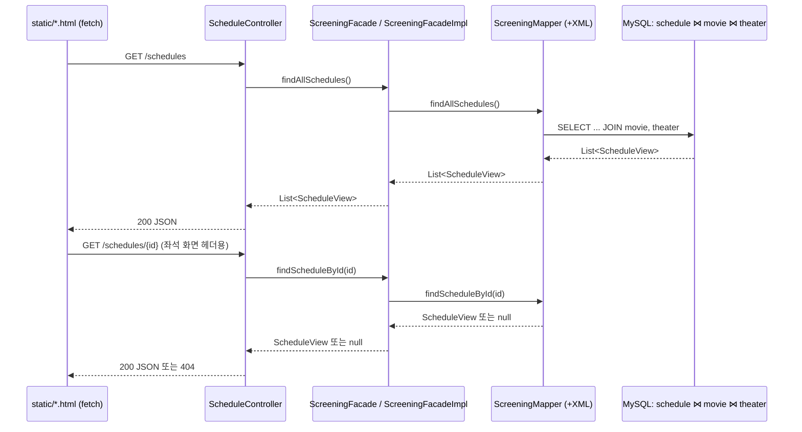

좌석 격자(`GET /schedules/{id}/seats`)는 screening 소유가 아니라 `SeatFacade.getSeatGrid()`를 그대로 호출한다 — §3 참고.

---

## 3. `seat` 도메인 ✅ 완성

### 3-1. `holdPessimistic` — 대기형 (비관적 락)

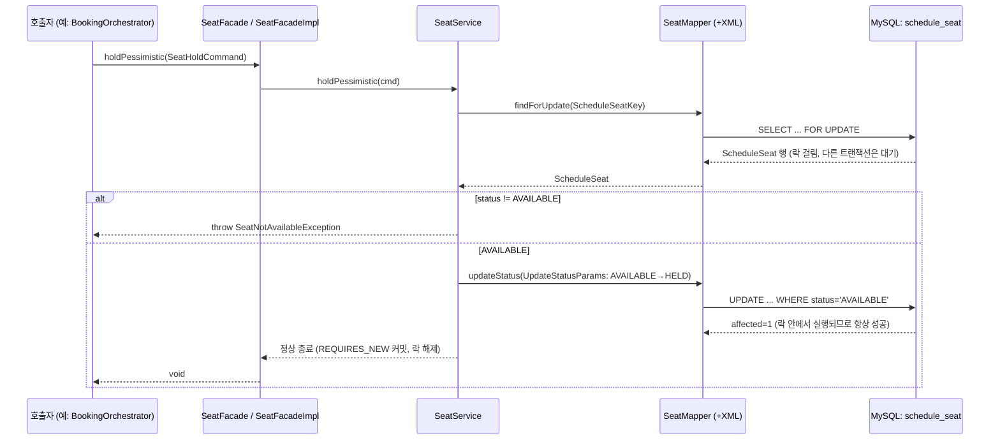

### 3-2. `holdOptimistic` — 충돌감지형 (낙관적 락)

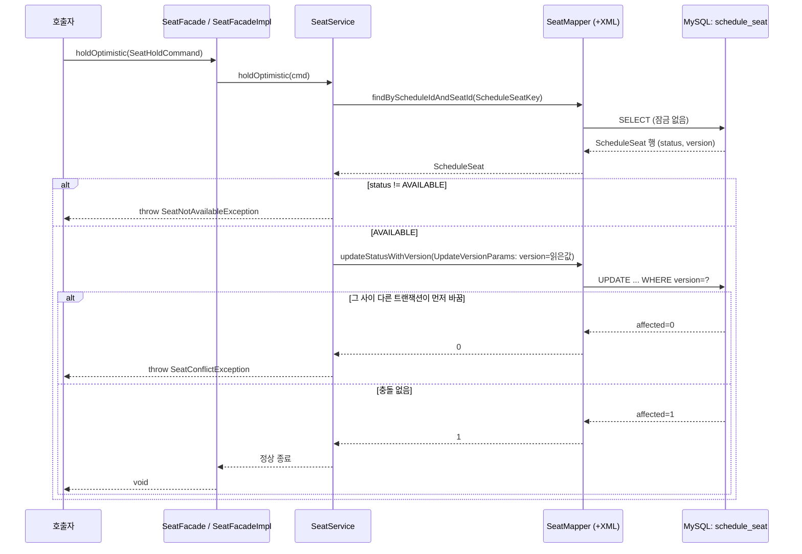

### 3-3. `confirm` / `release` — 단순 조건부 UPDATE (락 경합 없음)

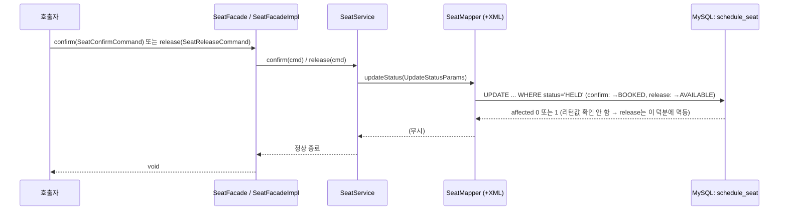

### 3-4. `getSeatGrid` — 좌석 격자 조회 (ScheduleController, polling 재사용)

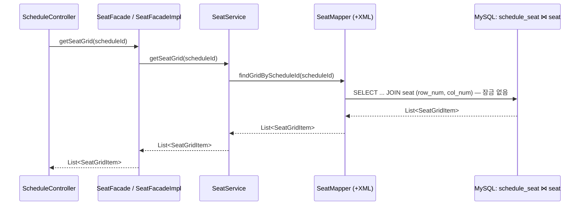

---

## 4. `payment` 도메인 ✅ 완성

### 4-1. `pay()` — 정상 성공 경로

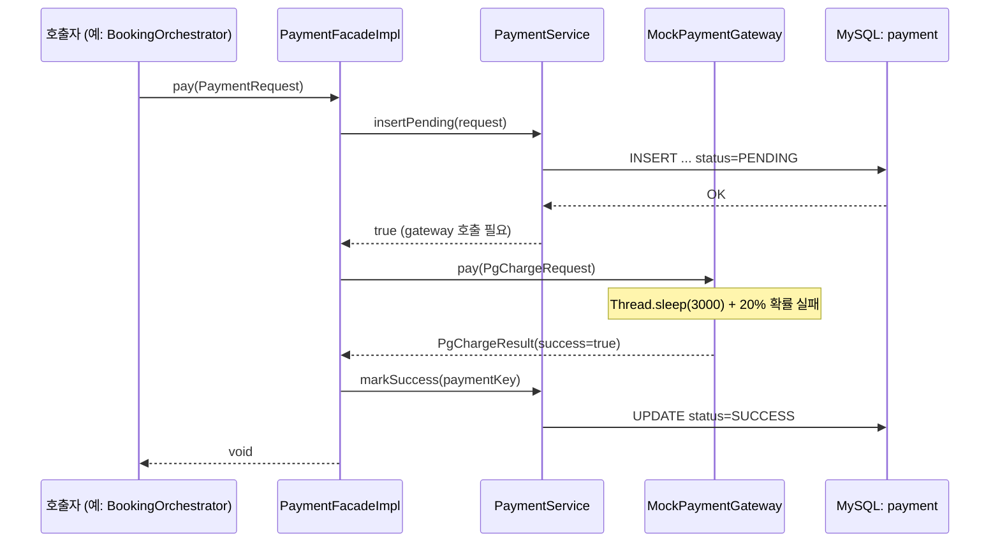

### 4-2. `pay()` — 결제 거절 경로

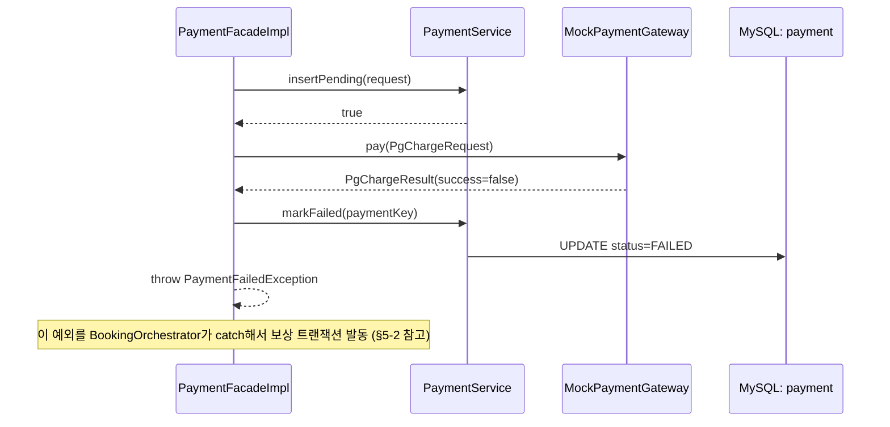

### 4-3. `pay()` — 중복 `payment_key` 경로 (재시도 상황)

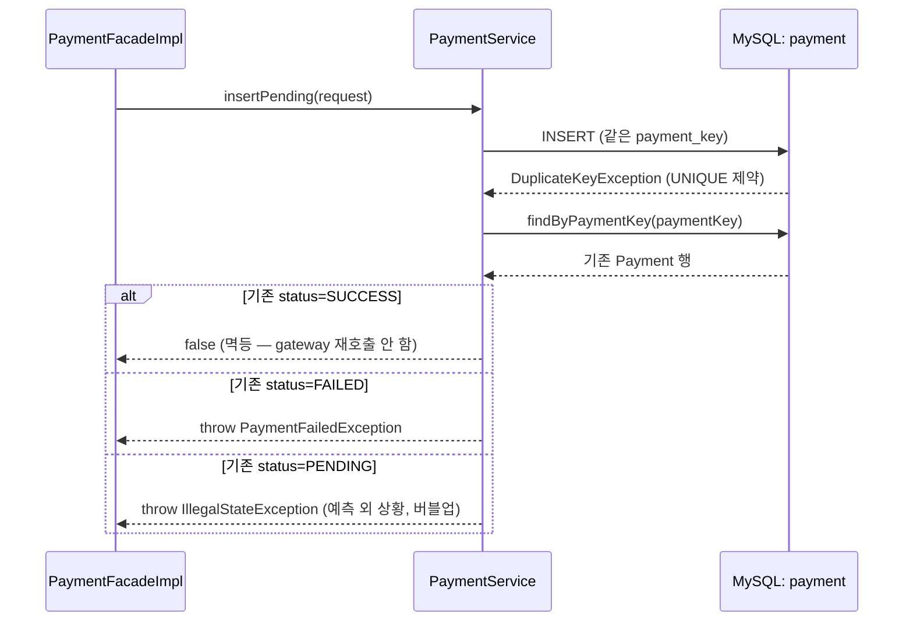

---

## 5. `notification` 도메인 ✅ 완성

Service 계층이 없다 — DB도, 외부 호출도 없어서 Facade가 바로 처리한다.

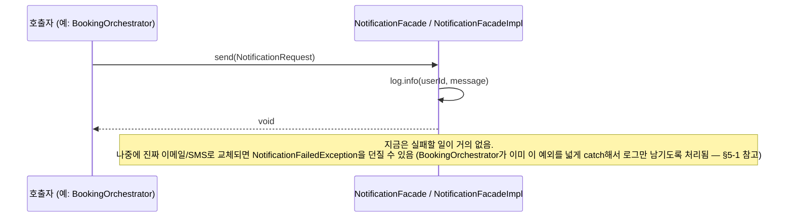

---

## 6. `booking` 도메인 ✅ 완성 — 전체 Saga가 여기서 조립됨

### 6-1. `reserve()` — 성공 경로 (POST /bookings)

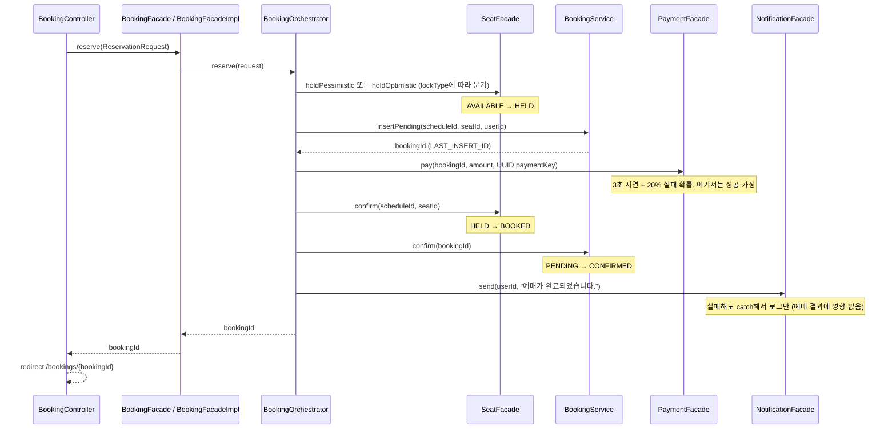

### 6-2. `reserve()` — 결제 실패 경로 (보상 트랜잭션)

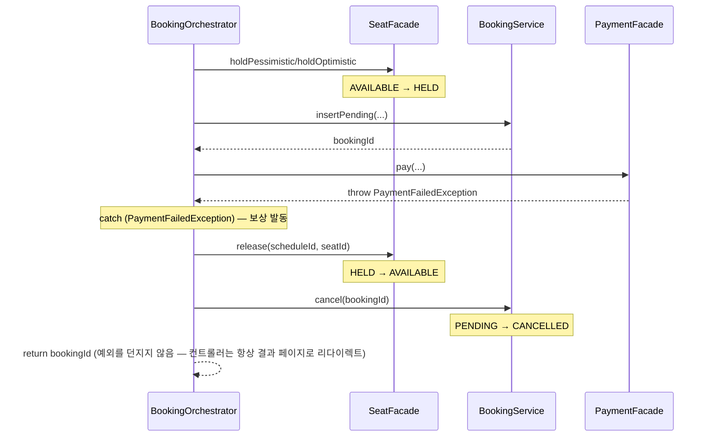

### 6-3. `getResult()` — 지연 재조정 (GET /bookings/{id})

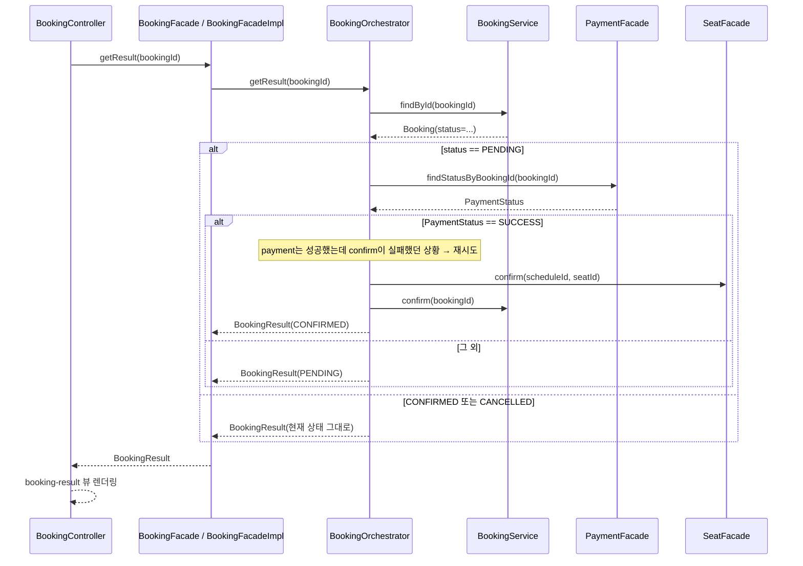

### 6-4. `BookingTimeoutBatch.reconcilePendingBookings()` — HELD 타임아웃 회수 (T-04, 2026-07-24)

`@Scheduled`는 아직 주석 처리 상태(사용자가 직접 해제 예정)라 지금은 `POST /admin/batch/reconcile-pending-bookings`
(`BookingTimeoutBatchController`)로만 호출된다. 두 분기(confirm 구제/release+cancel) 다 수동 검증 완료(2026-07-24).

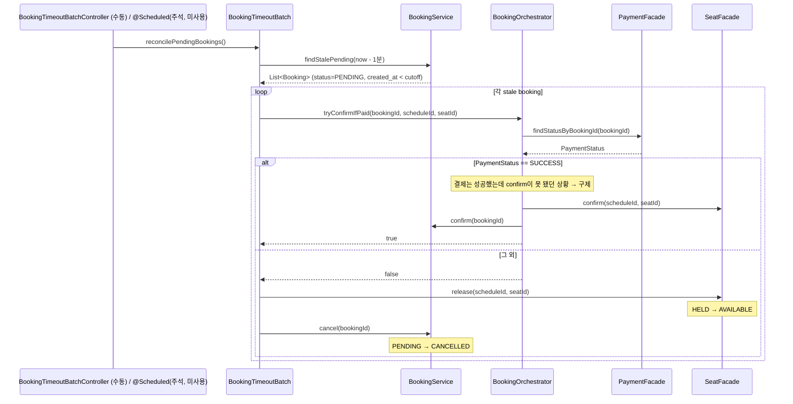

`tryConfirmIfPaid`는 `getResult()`(§6-3)와 완전히 같은 메서드 — package-private으로 풀어서 재사용한다
(다른 도메인이 `BookingOrchestrator`를 직접 호출 못 하게 `public`은 피함, AGENT.md §1). 배치도 Saga
오케스트레이터와 동일하게 `seat`는 `SeatFacade`를 거쳐서만 건드린다.
